# 整体架构
```
ASREvalPlatform/
├── backend/                    ← GPU 服务器上运行
│   ├── main.py                 ← FastAPI 入口，定义所有 API 路由
│   ├── database.py             ← SQLite 数据库模型，存储评测记录
│   ├── schemas.py              ← Pydantic 数据校验模型
│   ├── eval_engine.py          ← 评估引擎核心（复用你的脚本）
│   ├── dataset_loader.py       ← 扫描本地数据集目录
│   └── requirements.txt
│
├── frontend/                   ← 可以在任意机器上运行
│   ├── src/
│   │   ├── App.jsx             ← 路由和全局布局
│   │   ├── pages/
│   │   │   ├── Dashboard.jsx   ← 首页仪表盘
│   │   │   ├── NewEval.jsx     ← 发起新评测
│   │   │   ├── Report.jsx      ← 单次评测报告详情
│   │   │   └── Compare.jsx     ← 多模型对比
│   │   ├── components/         ← 可复用组件
│   │   └── api.js              ← Axios 封装，统一请求后端
│   └── package.json
│
└── README.md
```
## 工程项目图

